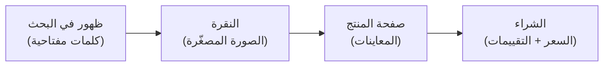

# كيف يصل الزبون ويشتري — الخيار أ (حزمة مستندات الأعمال)

**التاريخ:** ١٩ أغسطس ٢٠٢٦ · **المنتج:** عرض سعر + عقد + فاتورة + نطاق عمل

---

## الجواب المختصر

**أنت لا تجلب الزبون. السوق يجلبه.**

الزبون يكتب في مربع البحث «proposal template» وهو **يريد الشراء الآن**. لا تحتاج إقناعه ولا محتوى ولا جمهور — تحتاج **أن تكون ظاهراً في تلك اللحظة، وأن تفوز بالنقرة**.

هذا يقلب كل ما يُقال عن التسويق: **لا قمع، لا محتوى، لا سوشيال ميديا.** بحث وترتيب وصورة مصغّرة.

---

## أولاً: قرار المنصة — محسوم بالتحقق

| المنصة | الحالة للأردن | العمولة | البوابة |
|---|---|---|---|
| **Etsy** | ❌ **الأردن غير مؤهل** — تحقّقنا من صفحة إتسي الرسمية: ٦٢ دولة، منها مصر والإمارات والمغرب وتركيا، **وليس الأردن** | ٦.٥٪ + $0.20 | لا يوجد |
| **Envato / GraphicRiver** | ✅ **مفتوح** — قائمة الدول المحظورة عندهم لا تشمل الأردن · الدفع عبر Payoneer أو PayPal أو تحويل بنكي | **٥٠٪** (موحّدة منذ ١ يوليو ٢٠٢٦) | ⚠️ **مراجعة وقبول** |
| متجرك (Lemon Squeezy) | ✅ مفتوح | ~٥٪ + $0.50 | لا يوجد |

> **لا تحاول فتح متجر إتسي بعنوان غير حقيقي.** النتيجة إغلاق المتجر وحجز الأموال. القيد حقيقي فتعامل معه.

**القرار:** **Envato هو المسار الوحيد الذي يجمع "الأردن" + "زبون جاهز يبحث".**
ومتجرك الخاص يبقى **ثانوياً** لمن يصلك من خارج السوق — هامشه أعلى بكثير لكن حركته صفر.

**العمولة ٥٠٪ مؤلمة، والبديل صفر.** على $14: يصلك ~$7.

---

## ثانياً: القمع الحقيقي — أربع خطوات لا أكثر

**لكل خطوة رافعة واحدة تحكمها. اشتغل عليها بالترتيب.**

---

## ثالثاً: البوابة الصفر — المراجعة

**قبل أي شيء: Envato تراجع كل عنصر وترفض.**

وثائقهم الرسمية تذكر أن الرفض يعني «العنصر ليس بمستوى الجودة المطلوب»، وأن المرفوض على Elements **«لا يمكن تعديله أو تحديثه أو إعادة إرساله»**.

| افترض | لا تفترض |
|---|---|
| أول محاولة قد تُرفض | أن الرفض نهاية الطريق على Market |
| اقرأ متطلبات الجودة **قبل** التصميم | أن "جيد كفاية" يمر |
| ادرس أعلى ١٥ منتجاً وقلّد **مستوى الإتقان** لا التصميم | أن الأصالة تعوّض ضعف التنفيذ |

> **هذه أعلى نقطة فشل في الخطة كلها.** من يُرفض مرتين يستسلم عادةً. خطط لثلاث محاولات.

**[تحقق]** الصيغ المقبولة على GraphicRiver (InDesign / PSD / AI / Canva؟) — يقرر أي أداة تتعلمها. **افحصها قبل أن تصمم شيئاً.**

---

## رابعاً: الظهور — الكلمات المفتاحية

الزبون لا يتصفح، **يبحث بكلمة**. فالعنوان والوسوم هما توزيعك كله.

**اكتب العنوان بما يكتبه المشتري، لا بما تسمّيه أنت:**

| ❌ اسم إبداعي | ✅ عنوان بحثي |
|---|---|
| "Nexus Business Suite" | "Business Proposal Template — Client Proposal, Invoice & Contract" |

**طريقة استخراج الكلمات مجاناً:** افتح أعلى ١٥ منتجاً مبيعاً في الفئة، واقرأ **عناوينهم ووسومهم**. الكلمات التي تتكرر عند الفائزين هي ما يكتبه المشترون فعلاً. **لا تخترع كلمات — انسخ لغة السوق.**

---

## خامساً: النقرة — الصورة المصغّرة هي المنتج

**أهم أصل في المشروع كله ليس الملف، بل الصورة الأولى.**

المشتري يرى ٤٠ نتيجة متجاورة، ويقرر بالمظهر خلال ثانية. **الملف الممتاز بصورة رديئة = صفر مبيعات، والعكس صحيح تجارياً.**

| القاعدة | السبب |
|---|---|
| اعرض **المستند نفسه** لا شعاراً مجرداً | المشتري يشتري الشكل النهائي |
| اجعله مقروءاً في حجم مصغّر | يُعرض بحجم صغير جداً |
| **صفحات متعددة في صورة واحدة** | يوحي بالقيمة والحجم |
| قارن بمصغّرات المنافسين جنباً إلى جنب | معيارك هو محيطهم لا ذوقك |

**خصص لتصميم المصغّرة وقتاً يوازي تصميم المنتج.** ليست غلافاً — هي الإعلان الوحيد الذي ستملكه.

---

## سادساً: الشراء — ما يحسم في صفحة المنتج

| العنصر | ما يفعله |
|---|---|
| **معاينات لكل صفحة** | يزيل الخوف من "ماذا سأحصل عليه فعلاً" |
| **قائمة ما بداخل الحزمة** | يبرر السعر بالكم |
| **ذكر الصيغ صراحة** | أكبر سبب للتردد: "هل أستطيع تحريره ببرنامجي؟" |
| **السعر ضمن نطاق الفئة** | خارج النطاق يثير الشك لا الرغبة |

**سعّر عند $12–14** — داخل النطاق المثبت ($12 و$14 و$16 لأعلى العروض مبيعاً)، لا أرخص.
**الأرخص لا يفوز في هذه الفئة** — المشتري يشتري احترافية، والسعر المنخفض يوحي بالعكس.

---

## سابعاً: مشكلة البداية الباردة — صفر مبيعات وصفر تقييمات

**العنصر الجديد بلا مبيعات يترتب في الأسفل. هذه أصعب عقبة بعد المراجعة.**

| الحل | الشرح |
|---|---|
| **١. عشرة منتجات لا واحد** | كل منتج **مدخل بحث مستقل**. عشرة منتجات = عشرة فرص ظهور يومياً. وتكلفتك الحدية صفر |
| **٢. تنويعات ضيقة** | نفس الحزمة بزوايا مختلفة: «عرض سعر لوكالة تسويق» · «عرض سعر لمقاول» · «عرض سعر لمصور» — **كل واحدة تلتقط بحثاً مختلفاً بجهد إضافي ضئيل** |
| **٣. ادخل بسعر أدنى النطاق** | $12 بدل $16 حتى تتجمع أول التقييمات، ثم ارفع |
| **٤. استخدم "الأحدث"** | المنتج الجديد يظهر في فرز "newest" — نافذة ظهور مجانية قصيرة. **استغلها بمصغّرة ممتازة** |
| **٥. لا تنتظر مبيعة من كل منتج** | القاعدة: منتجان من عشرة يحملان الباقي. المهم أن تُطلق عشرة لتعرف أيها |

---

## ثامناً: الطريق إلى ألف — بالحساب الصادق

| المسار | الرياضيات |
|---|---|
| منتج واحد × ١٠٠٠ مبيعة | يحتاج منتجاً في أعلى ١٥ بالفئة · **احتمال منخفض للمبتدئ** |
| **عشرة منتجات × ١٠٠ مبيعة** | كل منتج يحتاج ~٢ مبيعة أسبوعياً لسنة · **واقعي** |
| عشرون منتجاً × ٥٠ | ~مبيعة أسبوعياً لكل منتج · **الأسهل** |

**صافيك عند الألف بسعر $14 وعمولة ٥٠٪: ~$7,000.**

**والزمن:** المنتجات في أعلى القائمة راكمت أرقامها على سنوات. **الألف هدف سنة أولى** إن أطلقت عشرة منتجات وواصلت. من يعدك بشهر يبيعك وهماً.

---

## تاسعاً: ترتيب التنفيذ

| # | الخطوة | لماذا هنا |
|---|---|---|
| ١ | **افحص متطلبات الجودة والصيغ المقبولة** | تقرر الأداة · وقبلها لا تصمم شيئاً |
| ٢ | **حلل أعلى ١٥ منتجاً**: عناوين · وسوم · أسعار · مصغّرات | تنسخ لغة السوق لا تخترعها |
| ٣ | **افتح حساب مؤلف واضبط الدفع** (Payoneer/PayPal) | التحقق يأخذ أياماً |
| ٤ | **صمّم المنتج الأول** بمستوى إتقان الأعلى مبيعاً | البوابة |
| ٥ | **صمّم المصغّرة بجهد يوازي المنتج** | رافعة النقرة |
| ٦ | **أرسل للمراجعة · توقّع الرفض · صحّح · أعد** | الواقع |
| ٧ | **بعد أول قبول: أطلق ٩ تنويعات** | البداية الباردة |
| ٨ | **راجع بعد ٩٠ يوماً**: أي منتج باع؟ | ضاعف على الفائز |

---

## ما لم يُتحقق منه بعد

- **الصيغ المقبولة على GraphicRiver** — الأهم، افحصه أولاً
- **مدة المراجعة الفعلية** ونسب القبول للمؤلفين الجدد
- **Creative Market و Design Bundles و Creative Fabrica** — أهليتها للأردن وعمولاتها؛ قد تكون بدائل أو منافذ إضافية
- **ضريبة القيمة المضافة** على مبيعات Envato وأثرها على صافيك

## المصادر

- [Etsy — الدول المؤهلة لـ Etsy Payments](https://help.etsy.com/hc/en-us/articles/115015710408-Countries-Eligible-for-Etsy-Payments) *(الأردن غير مدرج)*
- [Etsy — سياسة الرسوم](https://www.etsy.com/legal/fees/)
- [Envato — الدول المحظورة](https://help.author.envato.com/hc/en-us/articles/360000471303-What-Countries-Can-I-Not-Use-Envato-From)
- [Envato — نظام الدفع للمؤلفين](https://help.author.envato.com/hc/en-us/articles/20535795834393-Getting-Started-with-the-Envato-Payout-System)
- [Envato — هيكل عمولة المؤلف ٥٠٪](https://help.author.envato.com/hc/en-us/articles/360000472943-Introduction-to-Earnings)
- [Envato — أسباب الرفض الشائعة](https://help.author.envato.com/hc/en-us/articles/360000470786-Most-Common-Item-Rejection-Reasons-and-Tips-for-a-Successful-Elements-Application)
- [GraphicRiver — أعلى المبيعات في قوالب الطباعة](https://graphicriver.net/category/print-templates?sort=sales)
