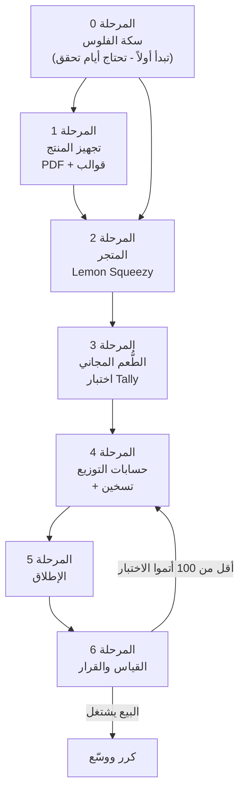
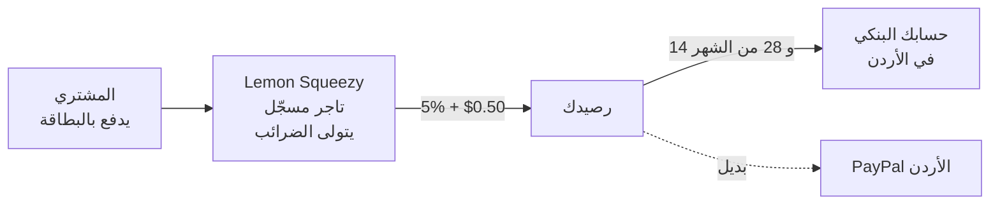
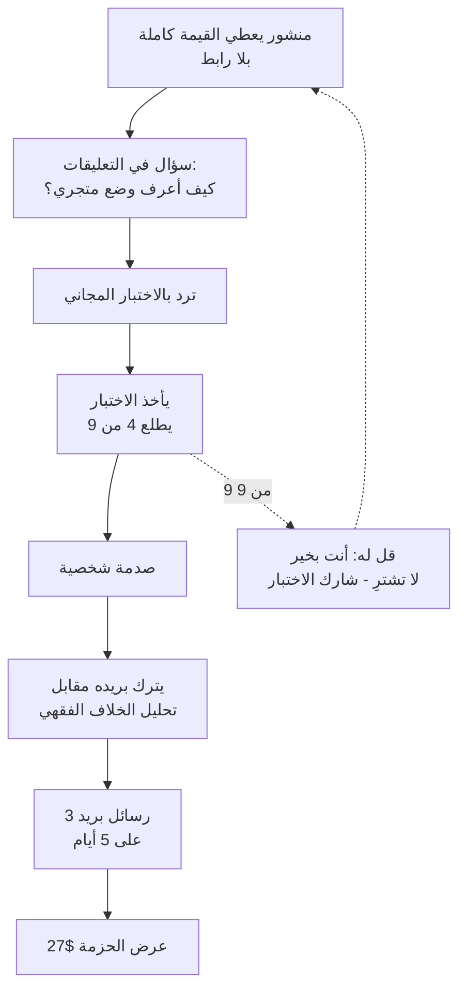

# الوركفلو الكامل — من صفر إلى أول دينار

### كل حساب، وظيفته، الأدوات، التحصيل، أين تعرض، أين تبيع، وكيف

> **اقرأ هذا بدل الخطط السابقة إن كنت تريد التنفيذ.** الخطة السابقة استراتيجية؛ هذه تشغيلية.
> **الترتيب هنا ليس اقتراحاً — هو ترتيب تبعية.** كل مرحلة تفتح التي بعدها.

---

## الخريطة العامة

**المرحلة ٤ (تسخين الحسابات) تبدأ بالتوازي مع المرحلة ٠** — لأنها تحتاج أسبوعين ولا تحتاج أي شيء جاهزاً.

---

## أولاً: الجمهور — من نستهدف بالضبط

**ليس "كل من يريد الربح من الإنترنت".** هذا الجمهور لن يشتري منك.

### الشريحة الأساسية (٨٠٪ من جهدك)

> **مسلم عربي، ٢٢–٣٥ سنة، بحث عن الدروبشيبينغ وتوقّف عند السؤال الشرعي ولم يبدأ.**

**لماذا هو المشتري المثالي:** عنده **ألم فعلي غير محسوم** (متوقف، لا بدأ ولا ارتاح) · والسؤال يمسّ ذمته لا محفظته فقط · **ولا يوجد منتج يخدمه** — كل المحتوى إما دروبشيبينغ بلا شرع، أو شرع بلا تنفيذ.

**أين هو حرفياً:**

| المكان | كيف تعرفه |
|---|---|
| مجموعات فيسبوك للتجارة الإلكترونية العربية | يسأل "شباب هل الدروبشيبينغ حلال؟" ويأخذ ٤٠ رداً متناقضاً |
| قنوات تيليجرام للتجارة والربح من الإنترنت | صامت، يقرأ فقط |
| X العربي — حسابات التمويل الإسلامي | يتفاعل مع محتوى المعاملات |
| تعليقات فيديوهات الدروبشيبينغ العربية | **أخصب مكان** — اقرأ التعليقات وستجد السؤال مكرراً بلا جواب |

### الشريحة الثانية (٢٠٪)

**صاحب متجر شغّال بدأ يشك في صحة معاملاته.** أقل عدداً، **لكنه يدفع أسرع** لأن عنده دخل وعنده قلق متراكم — وهو مرشح الطبقة $67.

### من لا تستهدف

| ❌ | لماذا |
|---|---|
| الباحث عن "ربح سريع" | لن يشتري منتجاً فصلٌ كامل منه عن الفشل |
| غير المسلم | الزاوية كلها لا تعنيه |
| المحترف المتمكن | عنده جوابه وعالمه |
| **الجمهور العام الواسع** | تكلفة الوصول له أعلى من هامشك بكثير |

---

## ثانياً: الحسابات — كل حساب ووظيفته

### المجموعة أ — سكة الفلوس (ابدأ بها اليوم)

| # | الحساب | وظيفته | التكلفة | مدة التفعيل | ملاحظة الأردن |
|---|---|---|---|---|---|
| ١ | **بريد عمل مخصص** (Gmail) | هوية المشروع · كل الحسابات تُربط به | مجاني | دقائق | **لا تستعمل بريدك الشخصي ولا بريد شركة** — لو تركت الشركة تخسر كل شيء |
| ٢ | **حساب بنكي أردني** | استلام تحويلات المنصة | موجود غالباً | — | يحتاج IBAN بالدولار أو حساب يستقبل تحويلات دولية — **اسأل بنكك** |
| ٣ | **PayPal الأردن** | استلام احتياطي + منصات تدفع بـPayPal | مجاني | ١–٣ أيام | ✅ **الأردن مصنّف رسمياً "Send, receive, and withdraw"** — يستقبل ويسحب |
| ٤ | **Payoneer** | بديل تحصيل إن تعثّر البنك | مجاني | ٢–٥ أيام | يعمل في الأردن · **افتحه احتياطاً ولو ما استخدمته** |

> **المرحلة ٠ تبدأ أولاً لأن التحقق من الهوية يأخذ أياماً.** لا تنتظر حتى يجهز المنتج — الحساب المعلّق في التحقق يعطّل الإطلاق كله.

### المجموعة ب — البيع والعرض

| # | الحساب | وظيفته | التكلفة |
|---|---|---|---|
| ٥ | **Lemon Squeezy** | **المتجر + الدفع + الفواتير + الضرائب** — كل شيء | مجاني حتى تبيع |
| ٦ | **Tally.so** | اختبار الـ٩ أسئلة + جمع البريد | مجاني |
| ٧ | **MailerLite** | قائمة البريد ورسائل المتابعة | مجاني حتى ١٠٠٠ مشترك |

### المجموعة ج — التوزيع (سخّنها من اليوم)

| # | الحساب | وظيفته | ملاحظة حرجة |
|---|---|---|---|
| ٨ | **X (تويتر)** | ثريدات الخلاف الفقهي · المصداقية | **يحتاج تسخين أسبوعين** |
| ٩ | **تيليجرام** | دخول مجتمعات التجارة الحلال | **لا تنشر روابط في أول أسبوع — تُحظر** |
| ١٠ | **فيسبوك** | مجموعات التجارة الإلكترونية العربية | حساب قديم أفضل من جديد بكثير |
| ١١ | **Canva** | تصميم جدول الشروط التسعة | مجاني |

> **قاعدة التسخين:** الحساب الجديد الذي ينشر رابطاً يُحظر. **أسبوعان من التعليق المفيد بلا رابط** يشتري لك حق النشر. ابدأ التسخين **اليوم**، بالتوازي مع كل شيء آخر.

---

## ثالثاً: طريقة التحصيل — مسار الفلوس

### المسار الموصى به

**لماذا Lemon Squeezy تحديداً:**

| السبب | التفصيل |
|---|---|
| **تاجر مسجّل (Merchant of Record)** | **هي** البائع قانونياً لا أنت — تتولى ضريبة القيمة المضافة الأوروبية والبريطانية وضرائب المبيعات. **بائع فرد من الأردن لا يستطيع التعامل مع هذا بنفسه** |
| **الأردن مدعوم** | تحويل بنكي — مؤكد من وثائقهم |
| **بلا رسوم شهرية** | لا تدفع شيئاً حتى تبيع |
| **رسوم واضحة** | ٥٪ + $0.50 لكل عملية |

**صافيك الفعلي:**

| السعر | رسوم LS | **يصلك** |
|---|---|---|
| $27 | $1.85 | **$25.15** |
| $67 | $3.85 | **$63.15** |

**البدائل إن تعثّرت:**

| البديل | متى تلجأ له |
|---|---|
| **Gumroad** | الأردن في قائمة التحويل البنكي عندهم · أبسط · **رسومه أعلى (~١٠٪) — تحقق قبل الاختيار** |
| **Payhip** | يدفع المشتري إلى **PayPal الخاص بك مباشرة** · أسرع وصولاً للفلوس · لكن التزامات الضريبة تقع عليك أكثر |

> **[تحقق]** الرسوم والدول تتغير. افتح صفحة التسعير والدول قبل أن تختار، ولا تعتمد على هذا الجدول بعد شهور.

### الجانب الشرعي لتحصيلك أنت

- **رسوم المنصة والبوابة = أجرة خدمة، لا ربا.** جائزة.
- **لا تفعّل أي ميزة "فائدة على الرصيد"** إن عُرضت عليك.
- **لا تأخذ سلفة على المبيعات المستقبلية** بفائدة.

---

## رابعاً: أين تعرض المنتج

**تمييز مهم يخلط فيه الناس:**

| | الوظيفة | أين |
|---|---|---|
| **العرض** (Display) | صفحة يقرأ فيها ماذا يشتري ويضغط "شراء" | **صفحة منتج Lemon Squeezy** — صفحة كاملة جاهزة، لا تحتاج موقعاً |
| **الاستضافة** (Hosting) | تسليم الملفات بعد الدفع | **Lemon Squeezy** تلقائياً — ترفع الملفات وتُسلَّم فوراً |
| **التسويق** (Marketing) | أين تتحدث عن المنتج | المجتمعات — **لا تبيع من داخل صفحة المنتج، تبيع قبلها** |

**لا تشترِ دومين ولا تبنِ موقعاً في البداية.** صفحة Lemon Squeezy تكفي حتى أول ٥٠ مبيعة. الدومين تحسين، لا شرط.

### ما تحمّله على المنتج

| الملف | الصيغة |
|---|---|
| الدليل | **PDF** (وليس Markdown — المشتري العربي يتوقع PDF) |
| القوالب الخمسة | PDF + ملفات نصية للنسخ واللصق |
| الحاسبة | CSV + رابط Google Sheets للنسخ |
| ملف "ابدأ من هنا" | صفحة واحدة تقول ماذا يفتح أولاً |

---

## خامساً: أين تبيع — وبأي ترتيب

**لا تفتح القنوات الخمس معاً.** واحدة تتقنها خير من خمس تهملها.

| الترتيب | القناة | لماذا هنا | متى تنتقل للتالية |
|---|---|---|---|
| **١** | **مجموعات تيليجرام وفيسبوك** (تجارة حلال، تمويل إسلامي، تجارة إلكترونية عربية) | جمهورك مركّز · بلا خوارزمية بينكما · **ولا منافس يخدمهم** | بعد ٣ منشورات جيدة |
| **٢** | **X العربي** | ثريدات الخلاف الفقهي تنتشر هنا أكثر من أي مكان | بعد أول ثريد يتجاوز ٥٠ إعادة نشر |
| **٣** | **تعليقات فيديوهات الدروبشيبينغ العربية** | الجمهور موجود **والسؤال مطروح بلا جواب** — أرخص صيد | بالتوازي مع ٢ |
| **٤** | فيديو قصير | يستهلك وقتاً كبيراً | فقط بعد أن يثبت البيع |
| **٥** | يوتيوب طويل | الأبطأ عائداً والأطول عمراً | الشهر الثالث |

---

## سادساً: طريقة البيع — الحركة الفعلية

**لا تبيع في المنشور. المنشور يعطي، والاختبار يبيع.**

### التسلسل خطوة بخطوة

**١. المنشور — يعطي ولا يطلب.**
اكتب الجواب **كاملاً داخل المنشور**. المجموعات تحظر الروابط لا المعرفة. المنشور الذي يستغني عن الرابط هو الذي يُشارك، لأن الأعضاء ينشرونه بلا إحساس بأنهم يسوّقون لك.

**٢. الرابط في التعليق أو الملف الشخصي — لا في المتن.**

**٣. الاختبار المجاني هو نقطة التحويل الحقيقية.** لأنه يعطي نتيجة شخصية صادمة، والصدمة تبيع أكثر من أي نص إعلاني.

**٤. البريد قبل البيع.** ٣ رسائل على ٥ أيام: شرح الخلاف الفقهي · شرح السؤال ٦ (بند الضمان) · العرض.

**٥. من خرج ٩/٩ — قل له لا تشترِ.** وحوّله إلى موزّع: "شارك الاختبار مع من يحتاجه". غير المشتري يصبح قناة.

---

## سابعاً: الأدوات وتكلفتها

| الأداة | الوظيفة | التكلفة |
|---|---|---|
| Lemon Squeezy | متجر + دفع + ضرائب + تسليم | **٠** حتى تبيع |
| Tally.so | الاختبار وجمع البريد | **٠** |
| MailerLite | البريد (حتى ١٠٠٠ مشترك) | **٠** |
| Canva | تصميم الجدول والصور | **٠** |
| تحويل PDF | تصدير الدليل | **٠** (لديك الأدوات) |
| دومين | *اختياري — أجّله* | ~$10/سنة |

### **إجمالي تكلفة الإطلاق: صفر**

> ميزانيتك ($100) **لا تُصرف على الإطلاق أصلاً** — احتفظ بها كاملة لاختبار الدروبشيبينغ لاحقاً، أو لترقية ما يثبت أنه يعمل. المنتج الرقمي رأس ماله وقتك لا نقدك، وهذا بالضبط سبب تصنيفه S.

---

## ثامناً: الجدول التنفيذي

| الأيام | العمل | المخرج | يعتمد على |
|---|---|---|---|
| **١** | افتح: بريد العمل · PayPal · Payoneer · اسأل بنكك عن الاستقبال الدولي | التحقق قيد التشغيل | — |
| **١** | **ابدأ تسخين X وتيليجرام وفيسبوك** — تعليقات مفيدة بلا روابط | الحسابات تنضج | — |
| **٢–٤** | حوّل الدليل والقوالب إلى PDF · جهّز ملف "ابدأ من هنا" | المنتج جاهز | — |
| **٥** | افتح Lemon Squeezy · ارفع الملفات · اكتب صفحة المنتج · اربط التحصيل | **المتجر حي** | المرحلة ٠ |
| **٦** | ابنِ الاختبار على Tally · اربط MailerLite | الطُّعم جاهز | — |
| **٧** | صمّم جدول الشروط التسعة على Canva **واسمك داخل الصورة** | الأصل المشارَك | — |
| **٨–٩** | اكتب ٣ رسائل البريد | التتابع جاهز | ٦ |
| **١٠** | **أول منشور** في مجموعة واحدة — قيمة كاملة، بلا رابط | أول اختبار حقيقي | ٤ + ٦ |
| **١١–١٤** | منشور يومياً في مجموعة مختلفة · رد على كل تعليق | التوزيع الأول | ١٠ |
| **١٥** | **أول ثريد على X** — الخلاف الفقهي كاملاً | المصداقية | التسخين |
| **١٦–٣٠** | قطعة يومياً · أعلن رقمك الاجتماعي · اختبر العناوين | التراكم | — |
| **٣٠** | **راجع:** كم أتمّ الاختبار؟ كم بيعة؟ من أي قناة؟ | القرار | — |

---

## تاسعاً: نقطة القرار عند اليوم ٣٠

| الملاحظة | التشخيص | الإجراء |
|---|---|---|
| أقل من ١٠٠ أتمّوا الاختبار | **مشكلة توزيع** | بدّل المجتمعات — لا تلمس المنتج |
| ١٠٠+ أتمّوا · صفر مبيعات | **مشكلة عرض** | راجع صفحة البيع والسعر ورسائل البريد |
| مبيعات موجودة من قناة واحدة | **وجدت القناة** | ضاعف عليها وأهمل الباقي |
| نتائج الاختبار أغلبها ٨–٩/٩ | **جمهور خاطئ** | أنت تصل لمتقنين — انزل لمجتمعات المبتدئين |

---

## عاشراً: أكثر ثلاثة أخطاء ستكلفك

1. **تبدأ بالمنتج وتؤجل سكة الفلوس.** التحقق يأخذ أياماً، فتجهز كل شيء وتقف. **المرحلة ٠ أولاً.**
2. **تنشر رابطاً من حساب عمره يومان.** تُحظر من المجموعة التي فيها جمهورك كله، ولا تعود. **سخّن أسبوعين.**
3. **تفتح خمس قنوات معاً.** تعمل شهراً بلا نتيجة في أي منها. **قناة واحدة حتى تثبت.**
