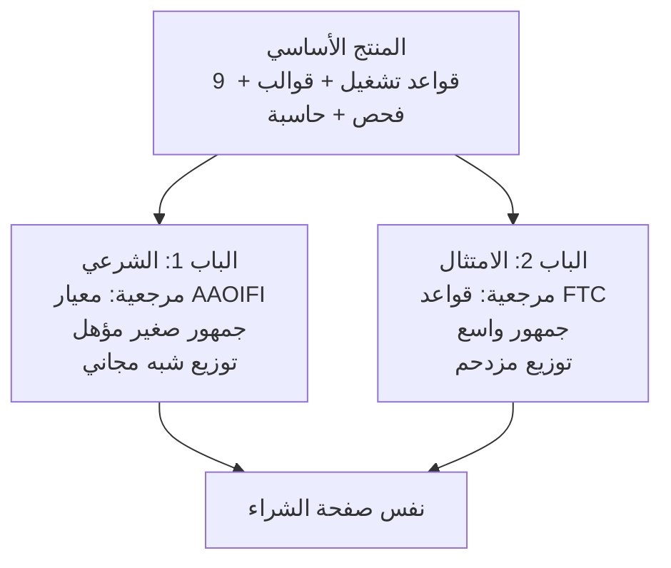

# النسخة غير الدينية — نفس القواعد، مرجعية أخرى

### كيف تبيع لجمهور أوسع بلا ذكر الدين إطلاقاً

---

## الجواب المباشر

**نعم — لكن ليس بالحذف.**

لو حذفت المرجع الديني وتركت الباقي كما هو، بتصير عندك "دليل دروبشيبينغ" عادي في **أكثر فئة محتوى تشبّعاً على الإنترنت**، بلا أي ميزة. الجمهور صار أكبر، والقدرة على الوصول إليه صارت صفراً.

**الحذف وحده يقتل المنتج. البديل: تعيد ربطه بألم آخر لا يقل حدّة.**

والخبر الممتاز: **الألم البديل موجود، وربما أقوى.**

---

## أولاً: المقايضة بصراحة

| ما تخسره | ما تكسبه |
|---|---|
| **التمايز** — لا أحد ينافسك في الزاوية الشرعية | جمهور أكبر بعشرات المرات |
| **جمهور مؤهَّل مسبقاً** — متوقف وعنده ألم غير محسوم | سوق لا سقف له |
| **مجتمعات جاهزة للمشاركة** بلا تكلفة وصول | قنوات أوسع لكن مزدحمة |
| **دافع المشاركة الأقوى** (ما يمس الذمة) | — |

> **"جمهور أكبر" ليست ميزة بذاتها.** الأصغر + المتألم + غير المخدوم يبيع أكثر من الأكبر + اللامبالي. Gadzhi نفسه ما بدأ بـ"ريادة الأعمال" — بدأ بـSMMA تحديداً، وتوسّع بعد ما ملك جمهوراً.

---

## ثانياً: التوصية — لا تختر، شغّل الاثنين

**المنتج واحد. الأبواب اثنان.**

**ما يتغير فعلياً: المقدمة، والتسمية، وعمود المرجعية في الجدول. لا شيء آخر.**

القوالب والفحص والحاسبة **تعمل حرفياً كما هي** — لأن السلوك المطلوب واحد، والمبرر فقط يختلف.

> ابدأ بالباب الشرعي **لأن توزيعه شبه مجاني**، وشغّل باب الامتثال بالتوازي حين تجهز.

---

## ثالثاً: الإطار البديل — التحقق من المصادر الأولية

نفس القواعد التسع، مبرَّرة بقانون أمريكي حقيقي وسياسات منصات — لأن **مشترينا يبيعون للسوق الأمريكي**:

| القاعدة | الأساس غير الديني | المرجع |
|---|---|---|
| **نافذة توصيل معلنة** | يجب أن يكون لدى البائع **أساس معقول** لتوقّع الشحن ضمن المدة المعلنة، وإلا فخلال **٣٠ يوماً** | **16 CFR 435** — قاعدة FTC للطلبات عبر الإنترنت |
| **تحمّل الضمان حتى التسليم** | عند العجز عن الشحن في الموعد: **يجب** عرض خيار على المشتري — الموافقة على التأخير أو **الإلغاء مع رد فوري**. وإن لم يُشحن، **يُعدّ الطلب ملغى ويُرد الثمن** | **16 CFR 435** |
| **حق الإلغاء والرد الكامل** | نفس القاعدة — الرد الفوري إلزامي لا تفضّل | **16 CFR 435** |
| **لا تقييمات مزيفة ولا محفّزة** | **محظورة فيدرالياً**. نافذة منذ **٢١/١٠/٢٠٢٤**. غرامات مدنية تصل **$53,088 لكل مخالفة**. وفي **٢٢/١٢/٢٠٢٥** أرسلت FTC إنذارات لعشر شركات — **التطبيق بدأ فعلاً** | **16 CFR 465** — قاعدة تقييمات المستهلك |
| **وصف منضبط ودقيق** | يقلل مرتجعات "ليست كما وُصفت" — وهي من أكبر ما يهدم تقييم البائع ويوقف الحسابات | سياسات المنصات |
| **توفر المخزون قبل البيع** | الإلغاء من طرف البائع مقياس أداء يوقف الحسابات | سياسات المنصات |
| **ثمن نهائي واضح قبل الدفع** | إخفاء الرسوم الإلزامية خداع تحت **قانون FTC المادة ٥**، وقوانين ولايات (كاليفورنيا) تحظره صراحةً | FTC §5 + قوانين ولايات |
| **فلتر استبعاد المنتجات** | المقلَّد والمحظور = **إيقاف فوري** وحجز الأموال | سياسات المنصات |
| **قبض الثمن كاملاً مقدماً** | لا نظير قانوني — لكن نظيره التشغيلي: **تدفق نقدي أسلم وتعرّض أقل للاحتيال** | تشغيلي |

### دقة إلزامية — لا تبالغ

| ✅ صحيح | ❌ لا تقله |
|---|---|
| قاعدة التقييمات المزيفة (16 CFR 465) تنطبق على المتاجر وغراماتها حقيقية | — |
| قاعدة الطلبات (16 CFR 435) تنطبق على البيع عبر الإنترنت | — |
| — | **"قاعدة الرسوم الخفية الفيدرالية تلزم كل المتاجر"** — **غير صحيح**: القاعدة الفيدرالية (16 CFR 464) تخص **تذاكر الفعاليات والإقامة قصيرة الأجل فقط**. استند للمادة ٥ وقوانين الولايات بدلها |
| — | أي رقم غرامة بلا مصدر — الأرقام تُعدَّل سنوياً للتضخم |

---

## رابعاً: التموضع الجديد

### الاسم

> ## **المتجر الذي لا يُغلق**
> ### ٩ قواعد تشغيل تحميك من إيقاف الحساب، ونزاعات البطاقة، وغرامات FTC

### الألم الذي تخاطبه

**كل دروبشيبر يخاف من شيء واحد: أن يصحو ويجد حسابه موقوفاً وأمواله محجوزة.**

هذا خوف **أوسع انتشاراً وأكثر إلحاحاً** من السؤال الشرعي — ويصيب المسلم وغيره، والمبتدئ والمحترف.

### الهوك

> **افتح شروط متجرك الآن، وابحث بـ Ctrl+F عن `not responsible`.**
> إن وجدتها، فأنت تخالف قاعدة FTC رقم 16 CFR 435 — التي تُلزمك بعرض الإلغاء والرد الفوري حين لا تشحن في موعدك. ونسختها من قالب جاهز مكتوب لحمايتك، لا لحمايتك من هذا.

**نفس الهوك، نفس الفعل، مرجعية مختلفة تماماً.** وهذا وحده يثبت أن التحويل ممكن.

### الاختبار المجاني

**"اختبر متجرك: هل هو معرّض للإيقاف؟"** — نفس التسعة أسئلة حرفياً، بعناوين مختلفة.

| النتيجة | التشخيص الجديد |
|---|---|
| ٩/٩ | متجرك محصّن — أنت في وضع نادر |
| ٦–٨ | ثغرة أو ثغرتان قابلتان للإصلاح في يوم |
| ٣–٥ | **معرّض للإيقاف** — تحتاج إعادة هيكلة |
| ٠–٢ | مخالفات متعددة · الخبر الجيد أنك لم تبنِ الكثير بعد |

---

## خامساً: الجمهور الجديد وأين هو

| | الباب الشرعي | باب الامتثال |
|---|---|---|
| **من** | مسلم متوقف عند السؤال الشرعي | أي دروبشيبر يخاف الإيقاف |
| **الحجم** | صغير | كبير جداً |
| **الإلحاح** | **عالٍ** — متوقف فعلاً | **عالٍ** — خصوصاً بعد أول إنذار أو نزاع |
| **أين** | مجتمعات التجارة الحلال والتمويل الإسلامي | مجموعات الدروبشيبينغ · منتديات البائعين · **مجموعات "تم إيقاف حسابي" — أخصب مكان** |
| **المنافسة** | **معدومة** | متوسطة — أغلب المحتوى عن الربح لا عن البقاء |

> **أفضل صيد في باب الامتثال:** مجموعات ومنشورات **من أُوقفت حساباتهم**. هؤلاء دفعوا ثمن الدرس فعلاً، وبيشتروا فوراً — لأنهم ما عادوا يحتاجون إقناعاً بأن المشكلة حقيقية.

---

## سادساً: ماذا يتغير في الملفات

| الملف | التغيير |
|---|---|
| `01-guide-AR.md` | **يُستنسخ** بمقدمة جديدة · عمود المرجعية يصير FTC/سياسات · **الجداول والقوالب كما هي** |
| `02-free-scorecard-AR.md` | نفس الأسئلة · عناوين ونتائج جديدة |
| `03-sales-page-AR.md` | نسخة موازية بالتموضع الجديد |
| `04-viral-marketing-plan-AR.md` | نفس الآليات · تتغير المجتمعات المستهدفة فقط |
| `05-workflow-AR.md` | **لا يتغير شيء** — نفس الحسابات ونفس التحصيل ونفس المتجر |
| `templates/` | **لا يتغير شيء** — السلوك واحد |

**العمل الفعلي المطلوب: يوم واحد.** أنت لا تبني منتجاً ثانياً، أنت تكتب مدخلاً ثانياً.

---

## سابعاً: تحذير بنفس أهمية الأول

في النسخة الشرعية قلنا في كل صفحة: **"لست مفتياً"**.

**في هذه النسخة القاعدة ذاتها: "لست محامياً."**

| ✅ | ❌ |
|---|---|
| "قاعدة FTC رقم 16 CFR 435 تنص على كذا — والرابط هنا" | "متجرك مخالف للقانون" |
| "راجع محامياً مختصاً قبل اعتماد أي صياغة" | "هذه الصياغة تحميك قانونياً" |
| اقتباس بمصدر ورقم قاعدة | استنتاج قانوني من عندك |

> **آلية المصداقية واحدة في النسختين:** استشهد بالمصدر الأولي · اذكر رقم القاعدة · تبرّأ من السلطة · أحِل القارئ إلى مختص. هذا ما جعل النسخة الشرعية قابلة للتصديق، وهو ما سيجعل هذه كذلك.

---

## الخلاصة

**نعم، الأسلوب يبقى كما هو بلا ذكر الدين — لأن القواعد التسع لم تكن دينية في أثرها أصلاً، بل في مرجعيتها.**

تحمّل الضمان، والإفصاح عن التوصيل، والوصف الدقيق، ومنع التقييمات المزيفة — هذه **ممارسات تجارية نظيفة** يفرضها القانون الأمريكي ويكافئها السوق. المرجعية الشرعية كانت **سبباً للوصول إليها**، لا شرطاً لصحتها.

**وهذا بالضبط ما يجعل التحويل ممكناً بلا أي تنازل.**

---

## المصادر

- [قاعدة FTC للطلبات عبر البريد والإنترنت والهاتف — 16 CFR Part 435](https://www.ftc.gov/legal-library/browse/rules/mail-internet-or-telephone-order-merchandise-rule) · [النص الكامل](https://www.ecfr.gov/current/title-16/chapter-I/subchapter-D/part-435)
- [قاعدة FTC لتقييمات المستهلك — الإعلان الرسمي](https://www.ftc.gov/news-events/news/press-releases/2024/08/federal-trade-commission-announces-final-rule-banning-fake-reviews-testimonials) · [أسئلة وأجوبة](https://www.ftc.gov/business-guidance/resources/consumer-reviews-testimonials-rule-questions-answers)
- [إنذارات FTC لعشر شركات — ديسمبر ٢٠٢٥](https://www.ftc.gov/business-guidance/blog/2025/12/warning-letter-or-ten-businesses-comply-ftcs-consumer-review-rule)
- [قاعدة الرسوم غير العادلة — 16 CFR 464 (تذاكر وإقامة فقط)](https://www.ftc.gov/news-events/news/press-releases/2025/05/ftc-rule-unfair-or-deceptive-fees-take-effect-may-12-2025)

**روجعت ١٩ أغسطس ٢٠٢٦.** القواعد والغرامات تُعدَّل — تحقق قبل كل نشر.
